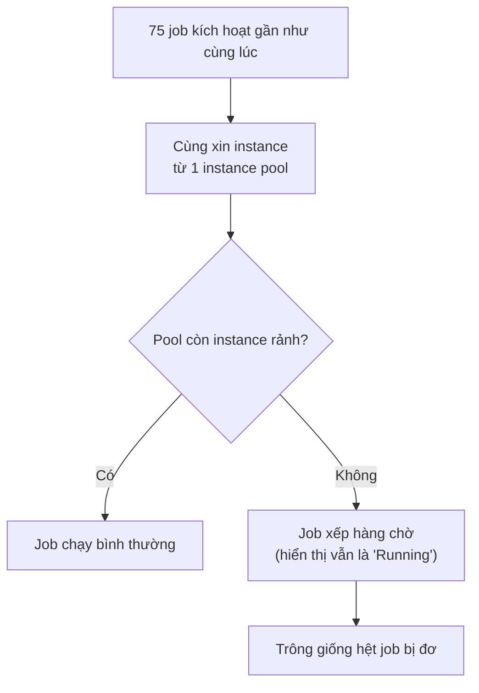

Bài 2 trong loạt ghi chép về feature store trên Databricks — nối tiếp
[bài 1 về kiến trúc offline/online store](/notes/thiet-ke-feature-store-tren-databricks). Bài này là
nhật ký debug một sự cố thật, ghi lại đúng thứ tự suy luận lúc đó — kể cả hai lần đoán sai — vì bản
thân quá trình loại trừ mới là phần đáng nhớ nhất.

## Triệu chứng

{/* PHÚC ĐIỀN: điền ngày giờ thật, hoặc giữ nguyên mô tả chung nếu không muốn nêu cụ thể */}
Mỗi đêm, {/* PHÚC ĐIỀN: số lượng job thật, ví dụ 75 */} job build feature table chạy theo lịch, thường
xong trong khoảng 15 phút mỗi job. Sáng hôm đó, dashboard Databricks Jobs cho thấy hàng chục job vẫn
ở trạng thái "Running" sau hơn 3 tiếng, 0% task tiến triển. Không có job nào fail — chỉ đơ.

## Nghi ngờ thứ nhất: code lỗi (sai)

Phản xạ đầu tiên: nghi ngờ một thay đổi code deploy hôm trước làm hỏng logic tính feature — có thể một
UDF rơi vào vòng lặp vô hạn hoặc một join bùng nổ số dòng (join explosion). Kiểm tra lại diff commit
gần nhất, không thấy gì bất thường ở phần logic transform.

Loại trừ được giả thuyết này nhờ một quan sát quan trọng: **cả những job hoàn toàn không đụng tới code
vừa deploy cũng bị đơ**. Nếu là lỗi logic thì chỉ job liên quan mới bị ảnh hưởng — triệu chứng lan
rộng đồng loạt gợi ý nguyên nhân nằm ở tầng hạ tầng chung, không phải code riêng từng job.

## Nghi ngờ thứ hai: xung đột ghi Delta Lake (gần đúng, nhưng chưa phải nguyên nhân chính)

Vì nhiều job cùng ghi vào các bảng feature có chung nguồn dữ liệu bronze/silver, nghi ngờ tiếp theo là
xung đột ghi đồng thời (`ConcurrentAppendException`) trên Delta Lake — nhiều transaction cùng cố commit
vào cùng một bảng, Delta phải retry liên tục.

Đào log driver thì đúng là có vài lần retry thật — nhưng không đủ để giải thích một job đơ suốt 3 tiếng
(retry kiểu này thường tự giải quyết trong vài giây tới vài phút). Đây là một giả thuyết "gần đúng
hướng" nhưng không phải nguyên nhân chính — bài học ở đây là tìm thấy MỘT triệu chứng khớp với giả
thuyết không có nghĩa giả thuyết đó đã đúng.

## Nguyên nhân thật: job không hề "chạy" — nó đang xếp hàng chờ cluster

Nhìn vào cluster events (không phải Spark UI) mới lộ ra vấn đề: instance pool phục vụ các job này có
giới hạn số lượng instance tối đa, được cấu hình dựa trên giả định các job khởi động rải rác trong
khoảng 2 tiếng. Đêm đó, một job upstream (vốn thường chạy xong sớm và trả lại instance cho pool) bị
trễ vì một sự cố riêng biệt {/* PHÚC ĐIỀN: nêu rõ nguyên nhân job upstream trễ nếu biết, hoặc xoá câu
này nếu không liên quan trong trường hợp thật của anh */} — kéo theo hiệu ứng dồn toa: gần như toàn bộ
75 job cùng cố giành instance từ pool trong một cửa sổ thời gian hẹp hơn hẳn bình thường, vượt quá giới
hạn tối đa của pool.

Điều gây nhầm lẫn nhất: giao diện Databricks Jobs hiển thị trạng thái "Running" ngay cả khi cluster của
job đó còn đang trong quá trình cấp phát (provisioning) — không có trạng thái riêng biệt rõ ràng cho
"đang xếp hàng chờ instance". Nhìn vào dashboard, một job đang chờ cluster và một job đang thật sự tính
toán trông giống hệt nhau.

## Cách xử lý

- Tăng giới hạn tối đa của instance pool, có kèm guardrail chi phí
  {/* PHÚC ĐIỀN: điền con số thật nếu muốn, ví dụ tăng từ X lên Y instance */}.
- Giãn lịch trigger của 75 job ra một khoảng thời gian rộng hơn thay vì gần như cùng một mốc giờ, giảm
  đỉnh nhu cầu instance tức thời.
- Thêm một metric giám sát riêng cho "thời gian chờ cấp phát cluster" (pending/provisioning time), tách
  bạch khỏi "thời gian job thực sự chạy" — để lần sau không còn nhầm lẫn giữa hai trạng thái này trên
  dashboard.

## Bài học

"Đơ" trên dashboard không đồng nghĩa với "code bị treo". Trước khi đào sâu vào logic Spark, luôn tách
riêng câu hỏi "job có đang thực sự thực thi không" khỏi "job có đang chờ tài nguyên không" — hai nguyên
nhân này cần công cụ chẩn đoán hoàn toàn khác nhau (Spark UI/driver log cho cái trước, cluster
events/instance pool metrics cho cái sau), và nhầm lẫn giữa chúng là lý do khiến tôi mất một buổi sáng
đi sai hướng hai lần trước khi nhìn đúng chỗ.
