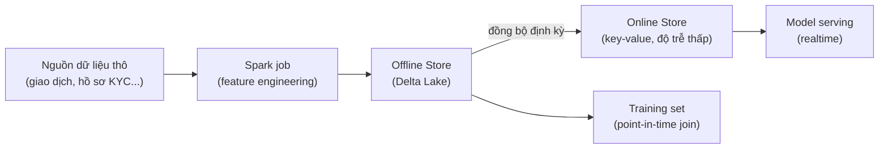

Bài 1 trong loạt ghi chép về feature store tôi đang vận hành ở ngân hàng — phục vụ mô hình chấm điểm
tín dụng và phát hiện gian lận. Bài này không phải hướng dẫn "dựng feature store từ A-Z", mà là ghi
lại những quyết định kiến trúc ban đầu — và lý do đằng sau — để 6 tháng sau tự mình đọc lại còn hiểu
vì sao ngày đó chọn vậy.

## Vì sao tách offline và online store

Yêu cầu huấn luyện mô hình và yêu cầu phục vụ dự đoán realtime có đặc tính rất khác nhau:

- **Offline (huấn luyện)**: cần lịch sử đầy đủ, chấp nhận độ trễ đọc vài giây tới vài phút, ưu tiên
  đúng — sai một dòng feature có thể làm sai cả mô hình.
- **Online (serving)**: chỉ cần giá trị feature mới nhất, nhưng đòi hỏi độ trễ đọc dưới
  {/* PHÚC ĐIỀN: điền ngưỡng SLA thật, ví dụ p99 < 50ms */} mili-giây — Delta Lake (dù có Z-order,
  data skipping) không được thiết kế cho kiểu truy vấn "lấy đúng 1 dòng theo khóa" ở tốc độ đó.

Vì vậy kiến trúc tách hẳn hai đường: **offline store** trên Delta Lake là nguồn chân lý duy nhất, và
**online store** ({/* PHÚC ĐIỀN: Redis / DynamoDB / Cosmos DB / công cụ thật đang dùng */}) chỉ là bản
sao được đồng bộ định kỳ từ offline store, tối ưu cho đọc theo khóa.

## Point-in-time correctness — chỗ dễ sai nhất

Đây là khái niệm quan trọng nhất trong toàn bộ thiết kế, và cũng là chỗ dễ vô tình làm rò rỉ dữ liệu
tương lai (data leakage) nhất nếu không cẩn thận. Khi dựng training set cho một mẫu ở thời điểm $t$,
feature phải được lấy đúng giá trị **tại thời điểm $t$**, không phải giá trị mới nhất hiện tại.

Ví dụ cụ thể: mẫu huấn luyện là một giao dịch xảy ra ngày 1/3. Nếu feature "số dư trung bình 30 ngày"
được tính từ dữ liệu tính tới ngày hôm nay (thay vì tính tới ngày 1/3), mô hình sẽ học từ thông tin nó
không thể biết được tại thời điểm dự đoán thật — độ chính xác lúc backtest cao bất thường, rồi rớt
thảm khi lên production. Đây chính xác là dạng "hidden feedback loop" mà paper Hidden Technical Debt
in Machine Learning Systems (đã phân tích trong thư viện Papers) cảnh báo — chỉ có join sai thời điểm
mới lộ ra khi model đã chạy production một thời gian.

Cách xử lý: mọi bảng feature đều có cột `event_timestamp`, và việc build training set luôn là một
**as-of join** — với mỗi (entity, label_timestamp) trong tập nhãn, lấy giá trị feature mới nhất có
`event_timestamp <= label_timestamp`. Databricks Feature Engineering có hỗ trợ sẵn kiểu join này qua
`create_training_set` — {/* PHÚC ĐIỀN: nêu rõ đang tự viết as-of join bằng Spark hay dùng API có sẵn
của Databricks Feature Engineering, kèm ví dụ lookup key/timestamp key thật nếu tiện chia sẻ */}.

## Feature table: một bảng, một chủ sở hữu

Mỗi feature table có một entity key rõ ràng (ví dụ `customer_id`), một `event_timestamp`, và **một
đội sở hữu duy nhất**. Đây là quyết định cố ý để tránh đúng vấn đề "undeclared consumers" — không đội
nào được sửa schema hay logic tính feature của bảng không phải mình sở hữu; muốn dùng feature của đội
khác thì subscribe qua registry, không copy-paste logic tính toán.

## Điều chưa giải quyết xong

Vẫn còn vài điểm đang để ngỏ tại thời điểm viết bài này:

- Giám sát độ "cũ" (staleness) của online store khi job đồng bộ bị trễ — hiện chưa có alert tự động.
- Chưa có quy trình chính thức để "nghỉ hưu" (deprecate) một feature không còn ai dùng.

{/* PHÚC ĐIỀN: nếu đã có giải pháp cho 1 trong 2 điểm trên, viết thêm một mục riêng — nếu chưa, để
nguyên như một lời nhắc việc cần làm. */}

Bài 2 trong loạt này kể lại một sự cố cụ thể liên quan trực tiếp tới kiến trúc đã mô tả ở đây — khi 75
Spark job build feature table đồng loạt bị đơ.
