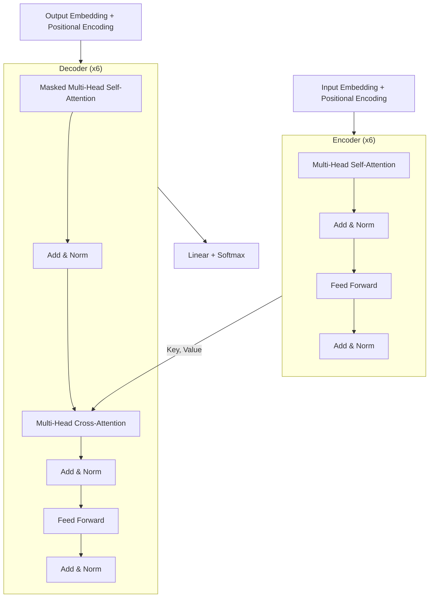

import Callout from '../../components/content/Callout.astro';

## Bối cảnh

Trước 2017, bài toán sequence-to-sequence (dịch máy, tóm tắt văn bản...) gần như đồng nghĩa với
RNN — cụ thể là LSTM hoặc GRU, xếp thành encoder-decoder, có thêm cơ chế attention kiểu Bahdanau
(2014) hoặc Luong (2015) gắn vào để decoder "nhìn" lại được toàn bộ encoder thay vì chỉ dựa vào một
vector ngữ cảnh cố định. Google Neural Machine Translation (GNMT) là đại diện tiêu biểu: rất mạnh,
nhưng bản chất vẫn là một chồng RNN khổng lồ.

Vấn đề nằm ở chính recurrence. RNN xử lý tuần tự — muốn tính trạng thái ẩn ở bước $t$ thì bắt buộc
phải có trạng thái ở bước $t-1$. Điều này chặn đứng khả năng song song hóa trong lúc huấn luyện: với
một câu dài 100 token, GPU phải "chờ" 100 bước tuần tự dù có hàng nghìn nhân tính toán rảnh rỗi. Hệ
quả là training chậm, và với chuỗi dài, thông tin từ token đầu câu phải đi qua rất nhiều bước trung
gian mới tới được token cuối câu — dù LSTM/GRU giảm nhẹ vanishing gradient, đường truyền thông tin
giữa hai vị trí xa nhau vẫn dài theo cấp số cộng với khoảng cách.

Hướng thay thế bằng convolution (ByteNet, ConvS2S, Extended Neural GPU) có song song hóa tốt hơn,
nhưng số phép tính cần thiết để liên hệ hai vị trí xa nhau vẫn tăng theo khoảng cách (tuyến tính với
ConvS2S, logarit với ByteNet) — chỉ đỡ hơn RNN chứ chưa giải quyết tận gốc.

## Vấn đề

Bài toán: học một hàm ánh xạ chuỗi ký hiệu đầu vào $(x_1, ..., x_n)$ thành chuỗi đầu ra
$(y_1, ..., y_m)$, trong khuôn khổ kiến trúc encoder-decoder, decoder vẫn sinh tự hồi quy
(autoregressive) — sinh $y_t$ dựa trên các $y$ đã sinh trước đó.

Mục tiêu cụ thể nhóm tác giả đặt ra:

1. Song song hóa được việc huấn luyện tốt hơn hẳn RNN (không còn phụ thuộc tuần tự giữa các vị trí
   trong cùng một chuỗi).
2. Số phép tính để liên hệ hai vị trí bất kỳ trong chuỗi phải là hằng số — không phụ thuộc khoảng
   cách giữa chúng.
3. Đạt chất lượng dịch máy ngang bằng hoặc vượt SOTA, với chi phí huấn luyện thấp hơn đáng kể.

Giả thiết ngầm: vẫn chấp nhận decoder sinh tuần tự lúc suy luận (inference) — bài toán chỉ nhắm vào
việc loại bỏ recurrence khỏi kiến trúc, không nhắm vào việc loại bỏ tính tuần tự của quá trình sinh
văn bản tự hồi quy.

## Ý tưởng cốt lõi

Thay vì để mỗi vị trí trong chuỗi phải truyền thông tin qua từng bước thời gian như RNN, cho phép
mọi vị trí "nhìn" thẳng vào mọi vị trí khác cùng một lúc và tự học nên chú ý vào đâu — đó là
self-attention. Toàn bộ mạng chỉ xây từ các lớp attention xếp chồng với feed-forward, bỏ hẳn
recurrence lẫn convolution. Vì phép tính ở mọi vị trí độc lập với nhau, GPU xử lý song song được
toàn bộ chuỗi trong một lượt thay vì phải đợi từng bước thời gian như trước.

## Phương pháp

### Kiến trúc tổng thể

Vẫn là encoder-decoder, nhưng cả hai đều là chồng $N = 6$ lớp giống hệt nhau, mỗi lớp chỉ gồm các
khối attention và feed-forward, có residual connection và layer normalization quanh mỗi sub-layer.

### Scaled dot-product attention

Công thức trung tâm của toàn bộ paper:

$$
\text{Attention}(Q, K, V) = \text{softmax}\left(\frac{QK^T}{\sqrt{d_k}}\right)V
$$

$Q$ (query), $K$ (key), $V$ (value) đều là ma trận. Tích $QK^T$ đo độ "khớp" giữa mỗi query và mỗi
key, softmax biến độ khớp đó thành trọng số, rồi lấy tổng có trọng số của $V$. Lý do chia cho
$\sqrt{d_k}$: khi $d_k$ lớn, tích vô hướng có xu hướng lớn theo, đẩy softmax vào vùng gradient cực
nhỏ (bão hòa) — scale xuống để giữ gradient ổn định.

### Multi-head attention

Thay vì làm attention một lần trên toàn bộ $d_{model} = 512$ chiều, chiếu tuyến tính $Q, K, V$ thành
$h = 8$ bộ khác nhau, mỗi bộ $d_k = d_v = d_{model}/h = 64$ chiều, chạy attention song song trên từng
bộ, rồi nối kết quả lại và chiếu tuyến tính một lần nữa:

$$
\text{MultiHead}(Q,K,V) = \text{Concat}(\text{head}_1, ..., \text{head}_h)W^O
$$

Lý do cần nhiều "đầu": một phép attention duy nhất buộc phải trung bình hóa mọi kiểu quan hệ vào
cùng một không gian biểu diễn. Nhiều đầu cho phép mô hình học song song nhiều kiểu quan hệ khác nhau
(cú pháp, đồng tham chiếu, khoảng cách gần...) ở các không gian con khác nhau.

Attention được dùng ở ba chỗ: (1) self-attention trong encoder — mỗi vị trí nhìn mọi vị trí của lớp
encoder trước; (2) self-attention trong decoder — mỗi vị trí chỉ được nhìn chính nó và các vị trí
trước đó (che các vị trí tương lai bằng mask $-\infty$ trước softmax, giữ tính tự hồi quy); (3)
cross-attention — query lấy từ decoder, key/value lấy từ đầu ra encoder, đúng vai trò của attention
kiểu Bahdanau/Luong trong các mô hình seq2seq cũ.

### Position-wise feed-forward

Mỗi vị trí đi qua cùng một mạng hai lớp tuyến tính với ReLU ở giữa, áp dụng độc lập cho từng vị trí:
$d_{model}=512 \to d_{ff}=2048 \to d_{model}=512$.

### Positional encoding

Vì không còn recurrence hay convolution, mô hình không có cách nào biết thứ tự token nếu không được
cấp thêm thông tin. Nhóm tác giả cộng thêm vào embedding một vector sin/cos tần số khác nhau theo
từng chiều:

$$
PE_{(pos, 2i)} = \sin\left(\frac{pos}{10000^{2i/d_{model}}}\right), \quad
PE_{(pos, 2i+1)} = \cos\left(\frac{pos}{10000^{2i/d_{model}}}\right)
$$

Chọn hàm sin/cos cố định thay vì embedding vị trí học được vì nhóm tác giả cho rằng nó "có thể" giúp
mô hình ngoại suy tới độ dài chuỗi dài hơn lúc train — một giả thuyết thiết kế, không phải kết quả đã
kiểm chứng (xem phần Phản biện).

### So sánh độ phức tạp

| Kiểu lớp | Độ phức tạp / lớp | Số phép tính tuần tự | Đường đi xa nhất giữa 2 vị trí |
|---|---|---|---|
| Self-attention | $O(n^2 \cdot d)$ | $O(1)$ | $O(1)$ |
| Recurrent | $O(n \cdot d^2)$ | $O(n)$ | $O(n)$ |
| Convolutional | $O(k \cdot n \cdot d^2)$ | $O(1)$ | $O(\log_k n)$ |

Đây chính là con số nói lên toàn bộ ý tưởng: self-attention đánh đổi độ phức tạp bậc hai theo độ dài
chuỗi ($n^2$) để lấy đường đi thông tin ngắn nhất có thể ($O(1)$) và song song hóa tuyệt đối.

## Thực nghiệm & kết quả

Hai benchmark dịch máy chính, WMT 2014:

| Mô hình | EN→DE (BLEU) | EN→FR (BLEU) | Chi phí train (FLOPs) |
|---|---|---|---|
| GNMT + RL | 24.6 | 39.92 | $1.4 \times 10^{20}$ |
| ConvS2S | 25.2 | 40.5 | $1.5 \times 10^{20}$ |
| Transformer (base) | 27.3 | 38.1 | $3.3 \times 10^{18}$ |
| **Transformer (big)** | **28.4** | **41.8** | $2.3 \times 10^{19}$ |

Transformer (big) vượt mọi kết quả công bố trước đó — kể cả các mô hình ensemble — hơn 2 điểm BLEU ở
EN→DE, và lập kỷ lục single-model ở EN→FR, trong khi chi phí huấn luyện chỉ bằng một phần nhỏ so với
các mô hình cạnh tranh (3.5 ngày trên 8 GPU P100 cho bản big).

Ablation (bảng 3 trong paper) đáng chú ý:

- Giảm xuống 1 head làm BLEU giảm 0.9 điểm so với cấu hình tốt nhất; quá nhiều head cũng làm giảm
  chất lượng — 8 head là điểm cân bằng cho cấu hình của họ, không phải "càng nhiều càng tốt".
- Positional encoding học được (learned) cho kết quả gần như giống hệt sinusoidal — không có bằng
  chứng thực nghiệm nào cho thấy sinusoidal thực sự tốt hơn trong phạm vi thí nghiệm của paper.
- Label smoothing cải thiện BLEU dù làm perplexity xấu đi — một minh chứng nhỏ rằng perplexity không
  phải lúc nào cũng là proxy tốt cho chất lượng dịch.
- Mô hình lớn hơn, dropout hợp lý hơn đều cải thiện kết quả — không có gì bất ngờ, nhưng paper trình
  bày rõ ràng, dễ tái lập.

Thí nghiệm phụ trên English constituency parsing (không phải dịch máy) cũng cho kết quả cạnh tranh dù
dữ liệu huấn luyện ít — được dùng làm bằng chứng cho việc kiến trúc "generalize" tốt ra ngoài dịch máy.

## Phản biện

<Callout type="critique">
**1. Độ phức tạp bậc hai không được bàn tới như một giới hạn thực sự.** Bảng so sánh trong chính
paper đã ghi rõ $O(n^2 \cdot d)$, nhưng toàn bộ phần thảo luận chỉ nói đây là đánh đổi hợp lý — không
một dòng nào cảnh báo rằng đây sẽ là nút thắt cổ chai lớn nhất của kiến trúc khi $n$ tăng lên hàng
chục nghìn token. Toàn bộ dòng nghiên cứu sau này về attention hiệu quả (Linformer, Performer,
Reformer, FlashAttention...) tồn tại chỉ để vá lại đúng lỗ hổng mà paper gốc không lường trước ở quy
mô sử dụng thực tế hôm nay.

**2. Tuyên bố về khả năng ngoại suy độ dài của positional encoding không được kiểm chứng.** Câu "may
allow the model to extrapolate to sequence lengths longer than the ones encountered during training"
là một giả thuyết thiết kế được viết ra nhưng không có thí nghiệm nào đi kèm để xác nhận. Nghiên cứu
sau này (về length generalization, các phương án thay thế như RoPE, ALiBi) cho thấy sinusoidal PE
thực chất ngoại suy khá kém — trực giác ban đầu của nhóm tác giả hóa ra không đứng vững.

**3. Bộ benchmark hẹp so với mức độ tổng quát của tuyên bố.** Kết quả chính chỉ dựa trên hai cặp ngôn
ngữ WMT (cùng miền tin tức), cộng thêm một thí nghiệm phụ về parsing. Từ đó suy ra kiến trúc
"generalize" tốt là một bước nhảy khá xa — không có đánh giá trên văn bản dài, ngôn ngữ ít tài
nguyên, hay các tác vụ non-generation nào khác ở thời điểm công bố.

**4. Không báo cáo phương sai giữa các lần chạy.** Nhiều so sánh ablation chỉ chênh nhau 0.1–0.9 BLEU
— hoàn toàn có thể nằm trong nhiễu giữa các lần chạy với seed khác nhau, nhưng paper không chạy nhiều
seed, không có error bar. Theo chuẩn ngày nay đây là một khoảng trống về mặt phương pháp, dù khá phổ
biến ở thời điểm 2017.
</Callout>

## Ứng dụng thực tế

<Callout type="application">
Nhìn từ vị trí một MLOps engineer đang vận hành hệ thống ML ở ngân hàng, giá trị của paper này không
nằm ở việc "triển khai nguyên bản" — không ai serve một Transformer 2017 trần trụi trong production
nữa — mà ở việc hiểu đúng những ràng buộc mà nó để lại cho mọi hệ thống dùng kiến trúc hậu duệ của nó
(GPT, Llama, Qwen...):

- **Chi phí suy luận tăng theo bình phương độ dài ngữ cảnh.** Bất kỳ use case nào cần xử lý tài liệu
  dài (hợp đồng tín dụng, hồ sơ KYC nhiều trang) đều phải tính đến chi phí này — trong thực tế ngày
  nay giải quyết bằng KV-cache, windowed/sparse attention, hoặc các biến thể attention hiệu quả hơn,
  chứ không phải bằng kiến trúc gốc trong paper.
- **Sinh văn bản vẫn tuần tự lúc inference** dù training song song hóa được — đây là nút thắt latency
  thật sự cho các ứng dụng tương tác thời gian thực (trợ lý chăm sóc khách hàng), đòi hỏi kỹ thuật
  nằm ngoài phạm vi paper: speculative decoding, batching động, quantization.
- **Rào cản dữ liệu và tuân thủ quy định là yếu tố quyết định, không phải kiến trúc.** Bất kỳ mô hình
  nào chạm vào dữ liệu khách hàng (hồ sơ KYC, nội dung giao dịch) đều kéo theo review về lưu trữ dữ
  liệu và bảo mật; nếu dùng API bên thứ ba, việc dữ liệu rời khỏi hạ tầng ngân hàng thường là điều
  không được phép theo quy định trong nước. Thực tế là bị giới hạn ở việc tự host các mô hình mã
  nguồn mở trong VPC của ngân hàng — kéo theo gánh nặng MLOps thật sự (GPU, serving, giám sát drift)
  mà bản thân paper không hề đề cập.
- **Positional encoding đã đổi khác ở các mô hình hiện đại** — phần lớn LLM sản xuất hôm nay dùng
  RoPE thay vì sinusoidal gốc, nên hành vi ngoại suy độ dài ngữ cảnh của mô hình đang dùng sẽ khác
  với những gì paper mô tả. Hiểu paper gốc giúp hiểu vì sao người ta đổi, không phải để giả định mô
  hình hiện tại vẫn hành xử giống hệt.
- **Với dữ liệu dạng bảng (góc nhìn từ feature store)**, attention truyền cảm hứng cho các mô hình
  như TabTransformer, nhưng với bài toán chấm điểm rủi ro tín dụng cổ điển, gradient-boosted trees
  vẫn thường thực tế hơn — do yêu cầu giải thích được quyết định cho mục đích tuân thủ, và do quy mô
  dữ liệu bảng thường không đủ lớn để attention phát huy lợi thế. Kiến trúc nổi tiếng nhất không đồng
  nghĩa là lựa chọn đúng cho mọi bài toán sản xuất.
</Callout>

## Liên hệ

Bài này chưa liên kết `relatedPapers` nào trên site — thư viện mới chỉ có 2 bài phân tích ở thời điểm
viết. Về mặt dòng chảy ý tưởng, đây là điểm khởi đầu cho gần như toàn bộ LLM hiện đại: BERT (dùng
riêng phần encoder), GPT (dùng riêng phần decoder, tự hồi quy), Vision Transformer (áp self-attention
lên ảnh), và cả dòng nghiên cứu attention hiệu quả (FlashAttention, Linformer...) sinh ra để giải
quyết đúng giới hạn $O(n^2)$ đã nêu ở phần Phản biện. Khi thư viện có thêm bài phân tích BERT hoặc
GPT, mục này sẽ được nối lại qua `relatedPapers`.

## Tài nguyên

- Paper gốc: xem nút "arXiv" ở đầu bài (arXiv:1706.03762)
- Code gốc: xem nút "Code" ở đầu bài (tensor2tensor, TensorFlow)
- PDF lưu trong `AI-Knowledge-Library`: chưa có — thư mục `LLM VLLM OCR` hiện chỉ có tài liệu giải
  thích phụ (`UNDERSTANDING TRANSFORMERS AND ATTENTION.pdf`), chưa có bản PDF gốc của chính paper
  này. {/* PHÚC ĐIỀN: nếu tải bản PDF gốc về AI-Knowledge-Library, điền lại `localPdf` trong
  frontmatter để nút "PDF (local)" hiện ra. */}
- Tài nguyên phụ hữu ích khi đọc lại paper: "The Annotated Transformer" (Harvard NLP) — bản chú giải
  từng dòng code khớp với từng công thức trong paper.
