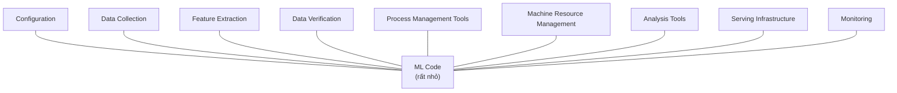

import Callout from '../../components/content/Callout.astro';

## Bối cảnh

Năm 2015, machine learning đã rời khỏi phòng thí nghiệm để vào thẳng các hệ thống production quy mô
lớn — xếp hạng quảng cáo, gợi ý nội dung, lọc spam. Câu chuyện phổ biến lúc đó là "dựng một mô hình
prototype thì dễ, cái khó là đưa vào production" — nhưng phần lớn tài liệu học thuật vẫn chỉ tập
trung vào cải tiến thuật toán, gần như không ai hệ thống hóa xem chi phí *vận hành và bảo trì lâu
dài* một hệ thống ML tốn kém ở đâu.

Kỹ thuật phần mềm truyền thống đã có sẵn khái niệm "technical debt" (nợ kỹ thuật — Ward Cunningham):
đi đường tắt để có kết quả nhanh trong ngắn hạn, đổi lại chi phí bảo trì tăng dần theo thời gian. Cái
mới của bài này là chỉ ra rằng hệ thống ML không chỉ gánh loại nợ đó ở tầng code như phần mềm thông
thường — nó còn có nguyên một tầng nợ đặc thù, sinh ra từ chính bản chất thống kê của mô hình, mà
công cụ kỹ thuật phần mềm truyền thống (test đơn vị, phân tích tĩnh, code review) không phát hiện
được.

## Vấn đề

Đây là một paper vị trí (position paper) đúc kết từ kinh nghiệm vận hành nhiều hệ thống ML thực tế ở
Google, không phải một bài toán có input/output hình thức. Câu hỏi trung tâm: vì sao hệ thống ML có
khả năng đặc biệt trong việc tích lũy nợ kỹ thuật, và những dạng nợ đó cụ thể là gì?

Luận điểm mở đầu, và cũng là hình ảnh đáng nhớ nhất của paper: trong một hệ thống ML thực tế, phần
code ML "thuần" (huấn luyện + suy luận) chỉ là một hộp đen rất nhỏ, nằm giữa một biển hạ tầng xung
quanh — thu thập dữ liệu, feature engineering, phục vụ, giám sát. Paper lập luận rằng chính phần
"xung quanh" đó, chứ không phải thuật toán, mới là nơi nợ kỹ thuật tích lũy nhanh và ẩn sâu nhất.

## Ý tưởng cốt lõi

Phần code ML thật sự chỉ chiếm một mẩu rất nhỏ trong toàn bộ hệ thống, còn lại là hạ tầng xung quanh
— và chính hạ tầng đó mới là nơi nợ kỹ thuật tích tụ nhanh nhất. Nợ trong hệ thống ML thường **ẩn**:
hệ thống vẫn chạy tốt, số liệu vẫn đẹp, cho tới khi một thay đổi tưởng vô hại ở chỗ khác âm thầm phá
vỡ một giả định ngầm ở một mô hình hoàn toàn khác. Paper đặt tên cho từng dạng "mùi nợ" cụ thể —
entanglement, feedback loop ẩn, glue code, pipeline jungle, config debt — để đội ngũ ML có từ vựng mà
tự kiểm tra hệ thống của mình.

## Phương pháp

Vì là paper vị trí, "phương pháp" ở đây là một khung phân loại (taxonomy), không phải thuật toán.

### Nhòe ranh giới bởi mô hình phức tạp

- **Nguyên lý CACE (Changing Anything Changes Everything)**: vì mô hình học cách trộn tín hiệu đầu
  vào theo những cách phi tuyến, khó đoán, thay đổi một feature, một hyperparameter, hay thậm chí chỉ
  thay đổi tập mẫu huấn luyện cũng có thể làm lệch hành vi ở những phần tưởng như không liên quan —
  không còn "sửa cái này, cái khác đứng yên" như module hóa cổ điển.
- **Correction cascade**: xây mô hình B như một lớp hiệu chỉnh đầu ra của mô hình A tạo ra phụ thuộc
  không lành mạnh — sai số của A bị "đóng băng" vào giả định của B, khiến sau này gần như không thể
  sửa hay thay thế A mà không kéo B đổ theo.
- **Undeclared consumers**: hệ thống khác âm thầm bắt đầu dùng đầu ra của một mô hình mà chủ mô hình
  không hề biết — một thay đổi tưởng an toàn có thể phá vỡ một hệ thống downstream không ai lường
  trước, vì chưa từng có ai "khai báo" sự phụ thuộc đó.

### Phụ thuộc dữ liệu tốn kém hơn phụ thuộc code

Công cụ phân tích tĩnh cho phụ thuộc code (ai gọi hàm nào) đã trưởng thành từ lâu; phụ thuộc dữ liệu
gần như không có công cụ tương đương. Hai "mùi nợ" cụ thể:

- **Unstable data dependencies**: tín hiệu đầu vào thay đổi theo thời gian một cách âm thầm — ví dụ
  một feature lấy từ mô hình của đội khác, đội đó retrain định kỳ mà không báo trước, khiến phân phối
  của feature dịch chuyển ngoài tầm kiểm soát của mô hình đang dùng nó.
- **Underutilized data dependencies**: feature chỉ đóng góp cải thiện độ chính xác rất nhỏ nhưng vẫn
  làm hệ thống giòn hơn — feature cũ không ai dám bỏ, feature "bundle" (thêm cả gói nhưng chỉ vài
  feature con thực sự hữu ích), feature tương quan cao che giấu việc chúng không thực sự độc lập.

### Feedback loop

Một mô hình có thể ảnh hưởng ngược lại chính dữ liệu huấn luyện tương lai của nó — ví dụ đầu ra của
hệ thống gợi ý trở thành dữ liệu huấn luyện cho vòng lặp kế tiếp. Loại vòng lặp này rất khó phát hiện
bằng phân tích thông thường vì nó không lộ ra như một phụ thuộc code trực tiếp — có thể mất hàng
tháng để hành vi mô hình trôi dạt (drift) theo một hướng không ai chủ đích thiết kế.

### Anti-pattern cấp hệ thống

- **Glue code**: để nhét một thư viện ML tổng quát vào một hệ thống cụ thể, phần lớn công sức là viết
  code "kết dính" xung quanh — paper ước tính chỉ khoảng 5% code thực sự là ML, phần còn lại là ống
  dẫn và tích hợp.
- **Pipeline jungle**: các pipeline chuẩn bị dữ liệu (thu thập, join, lấy mẫu) mọc lên một cách tự
  phát qua thời gian, tới mức gần như không thể test hay refactor an toàn.
- **Dead experimental codepaths**: nhánh điều kiện cho các thử nghiệm đã bỏ dở tích tụ trong code,
  ngày càng làm hệ thống khó đọc và dễ vỡ.
- **Configuration debt**: không gian cấu hình (chọn feature nào, tham số học nào, tiền/hậu xử lý nào)
  lớn tới mức tổ hợp, nhưng thường bị coi là chuyện phụ, không được review nghiêm túc như code.

### Khuyến nghị về test và giám sát

Paper đề xuất coi kiểm thử dữ liệu (data invariants), giám sát độ "cũ" của mô hình (staleness), và
giám sát độ lệch dự đoán nghiêm túc ngang hàng với unit test cho code thông thường — ý tưởng này sau
đó được chính một phần nhóm tác giả hình thức hóa đầy đủ hơn trong bài "The ML Test Score" (2017).

## Thực nghiệm & kết quả

Đây là điểm cần nói thẳng: paper **không có bảng số liệu hay thí nghiệm đối chứng** nào. Bằng chứng
là các case study và giai thoại rút ra từ kinh nghiệm vận hành thật của nhóm tác giả tại Google (hệ
thống dự đoán tỷ lệ click quảng cáo là ví dụ được nhắc tới nhiều lần). Đây không phải một khiếm
khuyết trình bày — nó phản ánh đúng bản chất một paper vị trí — nhưng là điều người đọc cần ý thức rõ
trước khi coi các luận điểm này là đã được "chứng minh" theo nghĩa thực nghiệm.

## Phản biện

<Callout type="critique">
**1. Bằng chứng thuần định tính, không đo lường được.** Không có phương pháp case-study hệ thống,
không có mẫu khảo sát, không định lượng "bao nhiêu nợ" hay chi phí thực của nó. Khung phân loại rất
thuyết phục về mặt trực giác, nhưng về bản chất đây là báo cáo kinh nghiệm từ một tập hệ thống cụ thể
(quảng cáo, tìm kiếm ở quy mô Google), không phải một nghiên cứu thực nghiệm đã kiểm chứng trên diện
rộng của ngành.

**2. Thiên lệch theo quy mô Google.** Nhiều hàm ý giải pháp (đội hạ tầng chuyên trách, công cụ nội bộ
sâu rộng, những gì sau này gọi là "feature store" trước khi thuật ngữ đó phổ biến) giả định nguồn lực
mà phần lớn tổ chức — nhất là một đội data ở ngân hàng tầm trung — đơn giản là không có. Một số cách
"giải quyết nợ" ngụ ý trong bài lại chính là một khoản đầu tư kỹ thuật khổng lồ, chỉ hợp lý ở quy mô
hyperscale.

**3. Chỉ chẩn đoán, gần như không kê đơn.** Đóng góp lớn nhất và bền vững nhất của paper là đặt tên
cho vấn đề — thuật ngữ này đã trở thành từ vựng chuẩn ngành. Nhưng paper gần như không đưa ra hướng
dẫn triển khai cụ thể cho phần lớn các loại nợ đã nêu (làm sao ngăn entanglement trong thực tế, ngoài
"cẩn thận hơn"? không có kiến trúc tham chiếu nào). Nó giống một checklist rủi ro hơn là một cẩm nang
kỹ thuật — phần "làm sao" bị bỏ ngỏ, và cả ngành đã dành cả thập kỷ sau đó để tự trả lời (feature
store, model registry, ML metadata tracking, các nền tảng MLOps).

**4. Viết trước làn sóng deep learning quy mô lớn.** Ra đời năm 2015, trước khi mô hình học biểu diễn
(representation learning) và mô hình nền tảng thay đổi hẳn cách feature được kỹ nghệ — đưa thẳng văn
bản/ảnh thô vào Transformer né được một phần "pipeline jungle" mà paper mô tả, nhưng đồng thời sinh
ra hẳn một lớp nợ mới paper không hề nhắc tới: trôi dạt do fine-tune, ghim phiên bản mô hình nền
tảng, rủi ro phụ thuộc API bên thứ ba, giám sát hallucination. Đọc paper hôm nay cần tự ngoại suy thêm
một lớp nợ mà chính các tác giả chưa từng thấy.
</Callout>

## Ứng dụng thực tế

<Callout type="application">
Đây là paper áp dụng trực tiếp nhất vào đúng công việc hằng ngày của tôi — feature store trên
Databricks phục vụ mô hình rủi ro tín dụng và gian lận ở ngân hàng — nên phần này viết từ trải nghiệm
thật, không phải suy diễn:

- **Feature store chính là liều thuốc trực tiếp cho "unstable/underutilized data dependencies".** Một
  feature store có versioning, chủ sở hữu rõ ràng, và theo dõi được ai đang tiêu thụ feature nào —
  đúng là hạ tầng được dựng ra để chặn chính hai "mùi nợ" paper nêu. Tính năng feature lineage của
  Databricks Feature Store là hiện thân trực tiếp của lời cảnh báo "undeclared consumers" trong bài.
- **CACE là rủi ro vận hành có thật, không phải lý thuyết**: retrain hay đổi trọng số một feature
  dùng chung có thể âm thầm dịch chuyển phân phối điểm số của một mô hình hoàn toàn khác đang dùng
  chung bảng feature đó (ví dụ mô hình gian lận và mô hình chấm điểm tín dụng cùng đọc một upstream
  feature). Đây là mục bắt buộc trong checklist review trước khi đổi bất kỳ feature dùng chung nào ở
  hệ thống của tôi. {/* PHÚC ĐIỀN: có thể kể một sự cố CACE thật đã gặp ở hệ thống hiện tại — ẩn danh
  chi tiết nếu cần, chỉ cần mô tả cơ chế xảy ra. */}
- **Configuration debt bị khuếch đại bởi yêu cầu tuân thủ.** Ở một ngân hàng, mọi thay đổi cấu hình
  cho một mô hình rủi ro tín dụng thường phải qua sign-off của bộ phận quản trị rủi ro mô hình — điều
  paper không hề đề cập nhưng là chi phí thật ở môi trường có quản lý. Giữ bề mặt cấu hình nhỏ và có
  tài liệu không chỉ là vệ sinh kỹ thuật, mà là điều kiện để vượt qua review tuân thủ.
- **Pipeline jungle ánh xạ trực tiếp vào tình trạng "notebook sprawl"** trên Databricks: pipeline
  feature dựng tự phát qua nhiều notebook của nhiều đội, không ai sở hữu rõ ràng, chính là pipeline
  jungle của năm 2015 mặc áo mới. Hướng xử lý thực tế: gom về thành các feature pipeline được khai
  báo, có test, có chủ sở hữu — thay vì để notebook mọc tự do.
- **Khung "nợ kỹ thuật" là công cụ thuyết phục, không chỉ là khung kỹ thuật.** Khi cần xin ngân sách
  để dựng feature store hay dọn dẹp pipeline — việc không mang lại KPI kinh doanh ngay lập tức — cách
  đóng khung "chúng ta đang trả lãi cho một khoản nợ" dễ thuyết phục lãnh đạo phi kỹ thuật hơn nhiều
  so với việc chỉ nói "code chưa sạch". Đây có lẽ là giá trị thực dụng nhất của paper đối với một
  MLOps engineer, ngoài phần từ vựng kỹ thuật.
</Callout>

## Liên hệ

Thư viện hiện chưa có bài phân tích riêng cho các paper cùng mạch chủ đề, nhưng đáng đọc tiếp trong
cùng bối cảnh: "The ML Test Score" (Breck et al., 2017 — hình thức hóa phần khuyến nghị test/giám sát
ở cuối bài này thành một rubric cụ thể) và "Operationalizing Machine Learning: An Interview Study" —
cả hai đều đã có sẵn trong `AI-Knowledge-Library`, chờ được phân tích khi thư viện mở rộng.

## Tài nguyên

- Trích dẫn gốc: D. Sculley et al., "Hidden Technical Debt in Machine Learning Systems", NeurIPS
  (NIPS) 2015 — không có bản arXiv riêng, bản gốc nằm trong kỷ yếu NeurIPS 2015
- PDF lưu trong `AI-Knowledge-Library`: xem nút "PDF (local)" ở đầu bài
- Đọc tiếp trong cùng thư mục `All about ML and MLOps`: "The MLTest Score.pdf", "Operationalizing
  Machine Learning - An Interview Study.pdf", "Supervisory Guidance on Model Risk Management.pdf"
  (khung quản trị rủi ro mô hình phía ngân hàng — bổ sung đúng góc nhìn tuân thủ mà paper này bỏ qua)
